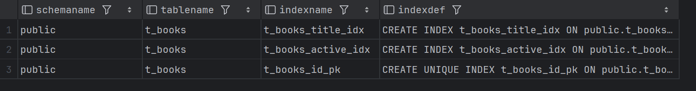
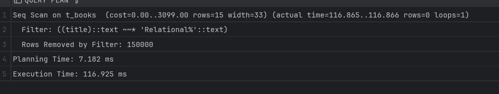

# Задание 1. B-tree индексы в PostgreSQL

1. Запустите БД через docker compose в ./src/docker-compose.yml:

2. Выполните запрос для поиска книги с названием 'Oracle Core' и получите план выполнения:
   ```sql
   EXPLAIN ANALYZE
   SELECT * FROM t_books WHERE title = 'Oracle Core';
   ```
   
   *План выполнения:*
   
   
   *Объясните результат:*
   Долгое время фактического исполнения, поиск идет просто последовательно по всем строкам. Высокая стоимость

3. Создайте B-tree индексы:
   ```sql
   CREATE INDEX t_books_title_idx ON t_books(title);
   CREATE INDEX t_books_active_idx ON t_books(is_active);
   ```
   
   *Результат:*
   

4. Проверьте информацию о созданных индексах:
   ```sql
   SELECT schemaname, tablename, indexname, indexdef
   FROM pg_catalog.pg_indexes
   WHERE tablename = 't_books';
   ```
   
   *Результат:*
   
   
   *Объясните результат:*
   Оба индекса успешно созданы, 1 был по умолчанию создан

5. Обновите статистику таблицы:
   ```sql
   ANALYZE t_books;
   ```
   
   *Результат:*
   

6. Выполните запрос для поиска книги 'Oracle Core' и получите план выполнения:
   ```sql
   EXPLAIN ANALYZE
   SELECT * FROM t_books WHERE title = 'Oracle Core';
   ```
   
   *План выполнения:*
   
   
   *Объясните результат:*
   Сканирование теперь с помощью индекса, намного уменьшился верхний порог стоимости (<10 - хорошо), но нижний порог теперь ненулевой. Из-за использования индекса фактическое время исполнения заметно сократилось.

7. Выполните запрос для поиска книги по book_id и получите план выполнения:
   ```sql
   EXPLAIN ANALYZE
   SELECT * FROM t_books WHERE book_id = 18;
   ```
   
   *План выполнения:*
   
   
   *Объясните результат:*
   Аналогично прошлому пункту используется для сканирования индекс, что заметно уменьшает время фактического исполнения

8. Выполните запрос для поиска активных книг и получите план выполнения:
   ```sql
   EXPLAIN ANALYZE
   SELECT * FROM t_books WHERE is_active = true;
   ```
   
   *План выполнения:*
   

   *Объясните результат:*
   Индекс не используется, хотя мы его создали. Это происходит, потому что уникальных значений очень мало в колонке is_active - всего 2: true и false.

9. Посчитайте количество строк и уникальных значений:
   ```sql
   SELECT 
       COUNT(*) as total_rows,
       COUNT(DISTINCT title) as unique_titles,
       COUNT(DISTINCT category) as unique_categories,
       COUNT(DISTINCT author) as unique_authors
   FROM t_books;
   ```
   
   *Результат:*
   

10. Удалите созданные индексы:
    ```sql
    DROP INDEX t_books_title_idx;
    DROP INDEX t_books_active_idx;
    ```
    
    *Результат:*
    

11. Основываясь на предыдущих результатах, создайте индексы для оптимизации следующих запросов:
    a. `WHERE title = $1 AND category = $2`
    b. `WHERE title = $1`
    c. `WHERE category = $1 AND author = $2`
    d. `WHERE author = $1 AND book_id = $2`
    
    *Созданные индексы:*
    ```sql
    CREATE INDEX t_books_title_category_idx ON t_books(title, category);
    CREATE INDEX t_books_title_idx ON t_books(title);
    CREATE INDEX t_books_category_author_idx ON t_books(category, author);
    CREATE INDEX t_books_author_book_id_idx ON t_books(author, book_id);
    ```
    
    *Объясните ваше решение:*
    Создаем индексы согласна используемым столбцам в запросе

12. Протестируйте созданные индексы.
    
    *Результаты тестов:*
    
    
    
    

    
    *Объясните результаты:*
    Во всех случаях индексы позволяют избежать последовательного сканирования, что существенно ускоряет выполнение запросов.

13. Выполните регистронезависимый поиск по началу названия:
    ```sql
    EXPLAIN ANALYZE
    SELECT * FROM t_books WHERE title ILIKE 'Relational%';
    ```
    
    *План выполнения:*
    
    
    *Объясните результат:*
    Очень высокая возможная стоимость и фактическое время выполнения - работа со строками дорогая.

14. Создайте функциональный индекс:
    ```sql
    CREATE INDEX t_books_up_title_idx ON t_books(UPPER(title));
    ```
    
    *Результат:*
    

15. Выполните запрос из шага 13 с использованием UPPER:
    ```sql
    EXPLAIN ANALYZE
    SELECT * FROM t_books WHERE UPPER(title) LIKE 'RELATIONAL%';
    ```
    
    *План выполнения:*
    
    
    *Объясните результат:*
    Индекс не используется. Видимо система считает изначальное дерево более оптимальным для поиска, чем созданное по индексу.

16. Выполните поиск подстроки:
    ```sql
    EXPLAIN ANALYZE
    SELECT * FROM t_books WHERE title ILIKE '%Core%';
    ```
    
    *План выполнения:*
    
    
    *Объясните результат:*
    Индекс не используется, так как для поиска вхождения подсктроки все равно приходится сканировать все строки

17. Попробуйте удалить все индексы:
    ```sql
    DO $$ 
    DECLARE
        r RECORD;
    BEGIN
        FOR r IN (SELECT indexname FROM pg_indexes 
                  WHERE tablename = 't_books' 
                  AND indexname != 'books_pkey')
        LOOP
            EXECUTE 'DROP INDEX ' || r.indexname;
        END LOOP;
    END $$;
    ```
    
    *Результат:*
    
    
    *Объясните результат:*
    Удалились все индексы кроме того, что был в таблице по умолчанию.

18. Создайте индекс для оптимизации суффиксного поиска:
    ```sql
    -- Вариант 1: с reverse()
    CREATE INDEX t_books_rev_title_idx ON t_books(reverse(title));
    
    -- Вариант 2: с триграммами
    CREATE EXTENSION IF NOT EXISTS pg_trgm;
    CREATE INDEX t_books_trgm_idx ON t_books USING gin (title gin_trgm_ops);
    ```
    
    *Результаты тестов:*
    
    
    
    *Объясните результаты:*
    1) индекс не используется.

    2) индекс используется, так как триграммный индекс специально оптимизирован для поиска подстрок

19. Выполните поиск по точному совпадению:
    ```sql
    EXPLAIN ANALYZE
    SELECT * FROM t_books WHERE title = 'Oracle Core';
    ```
    
    *План выполнения:*
    
    
    *Объясните результат:*
    В поиске по точному совпадению используется индекс, поскольку нет необходимости сканировать каждую строку.

20. Выполните поиск по началу названия:
    ```sql
    EXPLAIN ANALYZE
    SELECT * FROM t_books WHERE title ILIKE 'Relational%';
    ```
    
    *План выполнения:*
    
    
    *Объясните результат:*
    использован Bitmap Heap Scan + индекс

21. Создайте свой пример индекса с обратной сортировкой:
    ```sql
    CREATE INDEX t_books_desc_idx ON t_books(title DESC);
    ```
    
    *Тестовый запрос:*
    ```sql
    EXPLAIN ANALYZE
    SELECT * FROM t_books ORDER BY title DESC;
    ```
    
    *План выполнения:*
    
    
    *Объясните результат:*
    используется только что созданный индекс, что сильно уменьшает время выполнения запроса