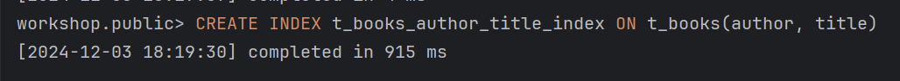

# Задание 2: Специальные случаи использования индексов

# Партиционирование и специальные случаи использования индексов

1. Удалите прошлый инстанс PostgreSQL - `docker-compose down` в папке `src` и запустите новый: `docker-compose up -d`.

2. Создайте партиционированную таблицу и заполните её данными:

    ```sql
    -- Создание партиционированной таблицы
    CREATE TABLE t_books_part (
        book_id     INTEGER      NOT NULL,
        title       VARCHAR(100) NOT NULL,
        category    VARCHAR(30),
        author      VARCHAR(100) NOT NULL,
        is_active   BOOLEAN      NOT NULL
    ) PARTITION BY RANGE (book_id);

    -- Создание партиций
    CREATE TABLE t_books_part_1 PARTITION OF t_books_part
        FOR VALUES FROM (MINVALUE) TO (50000);

    CREATE TABLE t_books_part_2 PARTITION OF t_books_part
        FOR VALUES FROM (50000) TO (100000);

    CREATE TABLE t_books_part_3 PARTITION OF t_books_part
        FOR VALUES FROM (100000) TO (MAXVALUE);

    -- Копирование данных из t_books
    INSERT INTO t_books_part 
    SELECT * FROM t_books;
    ```

3. Обновите статистику таблиц:
   ```sql
   ANALYZE t_books;
   ANALYZE t_books_part;
   ```
   
   *Результат:*
   

4. Выполните запрос для поиска книги с id = 18:
   ```sql
   EXPLAIN ANALYZE
   SELECT * FROM t_books_part WHERE book_id = 18;
   ```
   
   *План выполнения:*
   
   
   *Объясните результат:*
   Система выбрала нужную партицию, где находится book_id = 18, и выполнила по ней последовательное сканирование (Seq Scan). Это произошло потому, что индекс PRIMARY KEY не был унаследован партициями от родительской таблицы.

5. Выполните поиск по названию книги:
   ```sql
   EXPLAIN ANALYZE
   SELECT * FROM t_books_part 
   WHERE title = 'Expert PostgreSQL Architecture';
   ```
   
   *План выполнения:*
   
   
   *Объясните результат:*
   Результат может быть в любой партиции, поэтому сканируем все партиции.

6. Создайте партиционированный индекс:
   ```sql
   CREATE INDEX ON t_books_part(title);
   ```
   
   *Результат:*
   

7. Повторите запрос из шага 5:
   ```sql
   EXPLAIN ANALYZE
   SELECT * FROM t_books_part 
   WHERE title = 'Expert PostgreSQL Architecture';
   ```
   
   *План выполнения:*
   
   
   *Объясните результат:*
   Используется индекс, поскольку мы его явно создали. Он есть в каждой партиции и мы его используем везде.

8. Удалите созданный индекс:
   ```sql
   DROP INDEX t_books_part_title_idx;
   ```
   
   *Результат:*
   

9. Создайте индекс для каждой партиции:
   ```sql
   CREATE INDEX ON t_books_part_1(title);
   CREATE INDEX ON t_books_part_2(title);
   CREATE INDEX ON t_books_part_3(title);
   ```
   
   *Результат:*
   

10. Повторите запрос из шага 5:
    ```sql
    EXPLAIN ANALYZE
    SELECT * FROM t_books_part 
    WHERE title = 'Expert PostgreSQL Architecture';
    ```
    
    *План выполнения:*
    
    
    *Объясните результат:*
    Мы вручную создали разные индексы для каждой партиции, для каждой используется свой.

11. Удалите созданные индексы:
    ```sql
    DROP INDEX t_books_part_1_title_idx;
    DROP INDEX t_books_part_2_title_idx;
    DROP INDEX t_books_part_3_title_idx;
    ```
    
    *Результат:*
    

12. Создайте обычный индекс по book_id:
    ```sql
    CREATE INDEX t_books_part_idx ON t_books_part(book_id);
    ```
    
    *Результат:*
    

13. Выполните поиск по book_id:
    ```sql
    EXPLAIN ANALYZE
    SELECT * FROM t_books_part WHERE book_id = 11011;
    ```
    
    *План выполнения:*
    
    
    *Объясните результат:*
    Поиск произошел только в одной партиции, где может быть такой book_id

14. Создайте индекс по полю is_active:
    ```sql
    CREATE INDEX t_books_active_idx ON t_books(is_active);
    ```
    
    *Результат:*
    

15. Выполните поиск активных книг с отключенным последовательным сканированием:
    ```sql
    SET enable_seqscan = off;
    EXPLAIN ANALYZE
    SELECT * FROM t_books WHERE is_active = true;
    SET enable_seqscan = on;
    ```
    
    *План выполнения:*
    
    
    *Объясните результат:*
    Используется Beatmap Heap Scan, а потом используется индекс

16. Создайте составной индекс:
    ```sql
    CREATE INDEX t_books_author_title_index ON t_books(author, title);
    ```
    
    *Результат:*
    

17. Найдите максимальное название для каждого автора:
    ```sql
    EXPLAIN ANALYZE
    SELECT author, MAX(title) 
    FROM t_books 
    GROUP BY author;
    ```
    
    *План выполнения:*
    
    
    *Объясните результат:*
    Индекс не используется, поскольку мы используем функцию MAX, а индекс у нас просто по title.

18. Выберите первых 10 авторов:
    ```sql
    EXPLAIN ANALYZE
    SELECT DISTINCT author 
    FROM t_books 
    ORDER BY author 
    LIMIT 10;
    ```
    
    *План выполнения:*
    
    
    *Объясните результат:*
    Индекс используется

19. Выполните поиск и сортировку:
    ```sql
    EXPLAIN ANALYZE
    SELECT author, title 
    FROM t_books 
    WHERE author LIKE 'T%'
    ORDER BY author, title;
    ```
    
    *План выполнения:*
    
    
    *Объясните результат:*
    Индекс не используется, потому что сначала выбираем то, что подходит под лайк 

20. Добавьте новую книгу:
    ```sql
    INSERT INTO t_books (book_id, title, author, category, is_active)
    VALUES (150001, 'Cookbook', 'Mr. Hide', NULL, true);
    COMMIT;
    ```
    
    *Результат:*
    

21. Создайте индекс по категории:
    ```sql
    CREATE INDEX t_books_cat_idx ON t_books(category);
    ```
    
    *Результат:*
    

22. Найдите книги без категории:
    ```sql
    EXPLAIN ANALYZE
    SELECT author, title 
    FROM t_books 
    WHERE category IS NULL;
    ```
    
    *План выполнения:*
    
    
    *Объясните результат:*
    Индекс используется и скоращает время исполнения, посколько категорий достаточно много

23. Создайте частичные индексы:
    ```sql
    DROP INDEX t_books_cat_idx;
    CREATE INDEX t_books_cat_null_idx ON t_books(category) WHERE category IS NULL;
    ```
    
    *Результат:*
    

24. Повторите запрос из шага 22:
    ```sql
    EXPLAIN ANALYZE
    SELECT author, title 
    FROM t_books 
    WHERE category IS NULL;
    ```
    
    *План выполнения:*
    
    
    *Объясните результат:*
    Тут сразу используется индекс, потому что создавали мы его специально для строк, где category IS NULL

25. Создайте частичный уникальный индекс:
    ```sql
    CREATE UNIQUE INDEX t_books_selective_unique_idx 
    ON t_books(title) 
    WHERE category = 'Science';
    
    -- Протестируйте его
    INSERT INTO t_books (book_id, title, author, category, is_active)
    VALUES (150002, 'Unique Science Book', 'Author 1', 'Science', true);
    
    -- Попробуйте вставить дубликат
    INSERT INTO t_books (book_id, title, author, category, is_active)
    VALUES (150003, 'Unique Science Book', 'Author 2', 'Science', true);
    
    -- Но можно вставить такое же название для другой категории
    INSERT INTO t_books (book_id, title, author, category, is_active)
    VALUES (150004, 'Unique Science Book', 'Author 3', 'History', true);
    ```
    
    *Результат:*
    
    
    
    *Объясните результат:*
    Индекс проверяет уникальность только в рамках строк с category = 'Science'. Первая вставка прошла, так как дубликатов в этой категопии не было. Вторая попытка не удалась из-за нарушения уникальности, а третья сработала, потому что добавляемая строка относится к другой категории